# 📊 TabletTracker v1.0.0

> **Production tracking system for tablet manufacturing with Zoho integration**

A modern Python web application that revolutionizes tablet production tracking by replacing Google Forms with a real-time, integrated solution.

**🔄 Replaces:** Google Forms + Google Sheets workflow  
**☁️ Integrates:** Zoho Inventory API for seamless PO synchronization  
**📱 Optimized:** Mobile forms for warehouse staff, desktop dashboard for managers  
**🎨 Enhanced:** Modern UI with vibrant colors and responsive design

[](https://github.com/sahiwal283/TabletTracker/releases)
[](LICENSE)
[](https://python.org)
[](https://flask.palletsprojects.com/)

---

## 🏗️ System Architecture

### High-Level Architecture

```mermaid
graph TB
    %% User Interfaces
    subgraph Users ["👥 User Interfaces"]
        WF["📱 Warehouse Form<br/>(Mobile Optimized)"]
        CF["🔢 Count Form<br/>(Manual Counts)"]
        DB["📈 Dashboard<br/>(Desktop Interface)"]
        AP["⚙️ Admin Panel<br/>(Management)"]
    end
    
    %% Core Application
    subgraph Core ["🐍 Flask Application Core"]
        APP["Main Application<br/>app.py"]
        AUTH["Authentication<br/>& Sessions"]
        CONFIG["Configuration<br/>config.py"]
    end
    
    %% Business Logic
    subgraph Logic ["🧮 Business Logic"]
        CALC["Tablet Calculator<br/>(Display×Pack×Tablet)"]
        ALLOC["PO Allocation<br/>(FIFO Assignment)"]
        STATUS["Status Management<br/>(Workflow Automation)"]
    end
    
    %% Data Storage
    subgraph Storage ["🗄️ Data Storage"]
        SQLite[("SQLite Database<br/>tablet_counter.db")]
        
        subgraph Tables ["Database Tables"]
            PO["purchase_orders<br/>(PO Headers)"]
            PL["po_lines<br/>(Line Items)"] 
            TT["tablet_types<br/>(Master Data)"]
            PD["product_details<br/>(Multipliers)"]
            WS["warehouse_submissions<br/>(Production Data)"]
            SH["shipments<br/>(Tracking Info)"]
        end
    end
    
    %% External Integration
    subgraph External ["☁️ External Systems"]
        ZI["Zoho Integration<br/>zoho_integration.py"]
        ZAPI["Zoho Inventory API<br/>(Purchase Orders)"]
    end
    
    %% User Interactions
    WF --> AUTH
    CF --> AUTH  
    DB --> AUTH
    AP --> AUTH
    
    %% Core Processing
    AUTH --> APP
    APP --> CONFIG
    APP --> CALC
    APP --> ALLOC
    APP --> STATUS
    
    %% Data Flow
    CALC --> SQLite
    ALLOC --> PO
    ALLOC --> PL
    STATUS --> PO
    
    %% Form Processing
    WF --> WS
    CF --> WS
    WS --> ALLOC
    
    %% Database Relationships
    PO --> PL
    TT --> PD
    PD --> CALC
    PO --> SH
    
    %% Zoho Sync
    AP --> ZI
    ZI --> ZAPI
    ZAPI --> PO
    ZAPI --> PL
    
    %% Styling
    classDef ui fill:#e3f2fd,stroke:#1565c0,stroke-width:2px,color:#000
    classDef core fill:#fff3e0,stroke:#ef6c00,stroke-width:2px,color:#000
    classDef logic fill:#f3e5f5,stroke:#7b1fa2,stroke-width:2px,color:#000
    classDef data fill:#e8f5e8,stroke:#2e7d32,stroke-width:2px,color:#000
    classDef external fill:#fff8e1,stroke:#f57f17,stroke-width:2px,color:#000
    
    class WF,CF,DB,AP ui
    class APP,AUTH,CONFIG core
    class CALC,ALLOC,STATUS logic
    class SQLite,PO,PL,TT,PD,WS,SH data
    class ZI,ZAPI external
```


### Data Flow Process

```mermaid
sequenceDiagram
    participant W as 👷 Warehouse Staff
    participant WF as 📱 Warehouse Form
    participant APP as 🐍 Flask App
    participant DB as 🗄️ Database
    participant Z as ☁️ Zoho API
    participant A as 👨‍💼 Admin
    participant D as 📈 Dashboard
    
    Note over W,D: TabletTracker Data Flow
    
    %% Initial Setup
    A->>APP: 1. Admin Login
    APP->>A: Authentication Success
    A->>Z: 2. Sync POs from Zoho
    Z-->>DB: Import PO Data & Line Items
    
    %% Production Workflow
    W->>WF: 3. Enter Production Data
    Note over WF: • Employee Name<br/>• Product Type<br/>• Box/Bag Numbers<br/>• Production Counts
    
    WF->>APP: 4. Submit Production
    APP->>APP: 5. Calculate Tablets<br/>(Displays × PPD × TPP + Packs × TPP + Loose)
    
    APP->>DB: 6. Find Open PO Lines
    Note over DB: Match by Inventory Item ID
    
    APP->>DB: 7. Allocate to PO (FIFO)
    Note over DB: • Update good_count<br/>• Update damaged_count<br/>• Calculate remaining
    
    APP->>DB: 8. Auto-Progress Status
    Note over DB: Active → Processing → Complete
    
    APP-->>WF: 9. Success Response
    WF-->>W: Confirmation Message
    
    %% Admin Monitoring
    A->>D: 10. View Dashboard
    D->>DB: Query PO Status & Submissions
    DB-->>D: Real-time Data
    D-->>A: Display Progress & Analytics
    
    %% Shipment Tracking
    A->>APP: 11. Add Tracking Info
    APP->>DB: Update Shipments Table
    APP->>DB: Auto-Progress to "Shipped"
    
    Note over W,D: 🎯 Result: Real-time Production Tracking
```


---

## 🚀 Key Features

✅ **Mobile-Responsive Warehouse Form**
- Optimized for phones/tablets
- Auto-calculates tablet counts
- Validates against bag label count
- Shows discrepancy warnings

✅ **Admin Dashboard** 
- Desktop-optimized interface
- Real-time PO status tracking
- Recent submissions view
- Export capabilities

✅ **Zoho Integration**
- Syncs Purchase Orders automatically
- Matches by Inventory Item ID (not fragile name matching)
- Updates counts in real-time

✅ **Smart Business Logic**
- Allocates production to oldest open POs first
- Handles multiple line items per PO
- Tracks good vs damaged counts separately
- Auto-calculates remaining quantities

## Quick Start (Local Development)

1. **Setup Virtual Environment**
```bash
cd ~/Projects/Haute/TabletTracker
python -m venv venv
source venv/bin/activate  # On Windows: venv\Scripts\activate
pip install -r requirements.txt
```

2. **Setup Environment Variables**
```bash
cp env_template.txt .env
# Edit .env with your Zoho API credentials
```

3. **Initialize Database**
```bash
python setup_db.py
```

4. **Run Application**
```bash
python app.py
```

4. **Open in Browser**
- Main app: http://localhost:5000
- Warehouse form: http://localhost:5000/warehouse
- Admin dashboard: http://localhost:5000/dashboard

## PythonAnywhere Deployment

### 1. Upload Files
Upload your TabletTracker folder to PythonAnywhere

### 2. Install Dependencies
In PythonAnywhere console:
```bash
cd /home/yourusername/TabletTracker
pip3.10 install --user -r requirements.txt
```

### 3. Setup Environment Variables
In PythonAnywhere Dashboard > Files, create `.env`:
```
SECRET_KEY=your-production-secret-key
ZOHO_CLIENT_ID=your_zoho_client_id
ZOHO_CLIENT_SECRET=your_zoho_client_secret
ZOHO_REFRESH_TOKEN=your_zoho_refresh_token
ZOHO_ORGANIZATION_ID=856048585
```

### 4. Initialize Database
In console:
```bash
python3.10 setup_db.py
```

### 5. Configure Web App
In PythonAnywhere Web tab:
- Source code: `/home/yourusername/TabletTracker`
- WSGI file: Edit to point to your app.py
- Static files: `/static/` → `/home/yourusername/TabletTracker/static/`

### 6. Reload and Test
Hit "Reload" and visit your PythonAnywhere URL

## Zoho API Setup

### Get API Credentials
1. Go to https://api-console.zoho.com/
2. Create a new "Server-based Applications" client
3. Set redirect URL to: `http://localhost:8080` (for token generation)
4. Note your Client ID and Client Secret

### Get Refresh Token
1. Visit authorization URL (replace YOUR_CLIENT_ID):
```
https://accounts.zoho.com/oauth/v2/auth?scope=ZohoInventory.FullAccess.all&client_id=YOUR_CLIENT_ID&response_type=code&redirect_uri=http://localhost:8080&access_type=offline
```
2. Authorize and copy the code from the redirect URL
3. Exchange for refresh token using curl or Postman
4. Save the `refresh_token` from response

## Database Schema

### Core Tables
- **purchase_orders**: PO headers with totals
- **po_lines**: Individual line items per PO
- **tablet_types**: Master list with Inventory Item IDs
- **product_details**: Product configs with multipliers
- **warehouse_submissions**: All production submissions

### Key Relationships
- Product → Tablet Type → Inventory Item ID
- PO → Multiple Lines (by Inventory Item ID)
- Submissions → Auto-allocated to matching PO lines

## Workflow

### 1. PO Sync (Automated)
1. Zoho Inventory creates tablet PO
2. Admin clicks "Sync Zoho POs" in dashboard
3. System pulls PO + line items via API
4. Stores locally with Inventory Item IDs

### 2. Production Submission (Warehouse Staff)
1. Staff opens mobile form
2. Selects product, enters counts
3. System auto-calculates tablets using multipliers
4. Finds oldest open PO with matching Inventory Item ID
5. Allocates good/damaged counts to available capacity
6. Updates PO header totals

### 3. Monitoring (Managers)
1. Dashboard shows real-time PO status
2. Recent submissions log
3. Export capabilities for reporting

## Advantages Over Zoho Creator/Deluge

✅ **Real debugging** - actual error messages, logging, testing  
✅ **Full control** - custom UI, business logic, data flow  
✅ **Better mobile UX** - responsive design, touch-friendly  
✅ **Easier maintenance** - Python instead of Deluge syntax hell  
✅ **Future-proof** - can extend with any features you need  

---

## 🛠️ Technology Stack

| Component | Technology | Purpose |
|-----------|------------|---------|
| **Backend** | Flask 3.0.0 | Web application framework |
| **Database** | SQLite | Embedded database for development/production |
| **Frontend** | Tailwind CSS + HTMX | Modern responsive UI |
| **Integration** | Zoho Inventory API | PO synchronization |
| **Authentication** | Flask Sessions | Secure admin access |
| **Deployment** | PythonAnywhere | Production hosting |
| **Version Control** | Git + GitHub | Source code management |

---

## 📱 User Interfaces

### 📦 Warehouse Form (Mobile-First)
- **Purpose**: Daily production data entry by warehouse staff
- **Features**: Auto-calculation, validation, mobile-optimized
- **Access**: Direct link for easy mobile access

### 📈 Admin Dashboard (Desktop)  
- **Purpose**: Real-time monitoring and PO management
- **Features**: Progress tracking, analytics, export capabilities
- **Access**: Secure admin login required

### ⚙️ Admin Panel
- **Purpose**: System configuration and management
- **Features**: User management, product configuration, Zoho sync
- **Access**: Admin authentication with 8-hour session timeout

---

## 🔐 Security Features

- **🔒 Admin Authentication**: Environment-based password configuration
- **⏰ Session Management**: 8-hour timeout with secure cookies  
- **🛡️ Security Headers**: XSS, CSRF, and clickjacking protection
- **🚫 Error Handling**: Production-safe error responses
- **📝 Audit Logging**: Failed login attempt tracking

---

## 🚀 Quick Start

### Prerequisites
- Python 3.8+
- Git

### Local Development
```bash
# Clone the repository
git clone https://github.com/sahiwal283/TabletTracker.git
cd TabletTracker

# Set up virtual environment
python -m venv venv
source venv/bin/activate  # On Windows: venv\Scripts\activate

# Install dependencies
pip install -r requirements.txt

# Configure environment variables
cp env_template.txt .env
# Edit .env with your Zoho API credentials

# Initialize database
python setup_db.py

# Run the application
python app.py
```

Visit http://localhost:5001 to see your application!

---

## 📚 Documentation

- **[DEPLOYMENT.md](DEPLOYMENT.md)** - Complete PythonAnywhere deployment guide
- **[SECURITY.md](SECURITY.md)** - Security configuration and best practices  
- **[zoho_setup_guide.md](zoho_setup_guide.md)** - Zoho API integration setup

---

## 📊 Database Schema

```sql
-- Core PO Management
purchase_orders (id, po_number, zoho_po_id, tablet_type, status, quantities, dates)
po_lines (id, po_id, inventory_item_id, line_item_name, quantities)

-- Master Data  
tablet_types (id, tablet_type_name, inventory_item_id)
product_details (id, product_name, tablet_type_id, packages_per_display, tablets_per_package)

-- Production Tracking
warehouse_submissions (id, employee_name, product_name, counts, discrepancy_flags, assigned_po_id)
shipments (id, po_id, tracking_number, carrier, dates, notes)
```

---

## 🎯 Business Logic

### Production Calculation
```
Total Tablets = (Displays × Packages_Per_Display × Tablets_Per_Package) + 
                (Packs_Remaining × Tablets_Per_Package) + 
                Loose_Tablets + 
                Damaged_Tablets
```

### PO Allocation (FIFO)
1. Find open PO lines matching inventory item ID
2. Allocate production counts to oldest PO first
3. Auto-progress PO status based on completion
4. Update remaining quantities in real-time

---

## 🌟 Advantages Over Previous System

| Aspect | Old System (Google Forms) | TabletTracker |
|--------|---------------------------|---------------|
| **Data Entry** | Manual Google Forms | Mobile-optimized forms |
| **Calculations** | Manual spreadsheet formulas | Automatic calculation engine |
| **PO Tracking** | Manual updates | Real-time Zoho synchronization |
| **Mobile Experience** | Poor mobile support | Mobile-first design |
| **Error Detection** | Manual review | Automatic discrepancy detection |
| **Reporting** | Static spreadsheets | Real-time dashboard |
| **Security** | Google account based | Custom admin authentication |
| **Customization** | Limited by Google Forms | Fully customizable |

---

## 📈 Next Steps

1. **Test locally** with sample data
2. **Deploy to PythonAnywhere** 
3. **Setup Zoho API credentials**
4. **Test PO sync** with real data
5. **Train warehouse staff** on new mobile form
6. **Migrate from Google Forms**

---

## 📋 Version History

### v1.0.0 (Current) - Production Ready 🎉
- ✅ Complete Flask application with Zoho integration
- ✅ Modern UI with vibrant colors and responsive design
- ✅ Production security configuration  
- ✅ Admin authentication with session management
- ✅ Comprehensive deployment guides
- ✅ All tests passing and ready for deployment

### Upcoming Features
- [ ] Two-factor authentication for admin access
- [ ] Enhanced reporting and analytics
- [ ] Mobile app (PWA) for offline capability
- [ ] Advanced inventory forecasting

---

## 🤝 Contributing

This is a private repository for Haute internal use. For modifications or enhancements:

1. Create a feature branch from `main`
2. Follow the existing code style and structure
3. Test thoroughly before merging
4. Update documentation as needed

---

## 📞 Support

For issues or questions about this implementation, check:

1. **Documentation**: Review `DEPLOYMENT.md` and `SECURITY.md`
2. **Logs**: PythonAnywhere logs for runtime errors
3. **Frontend**: Browser console for UI issues  
4. **Testing**: `/dashboard` for business logic validation
5. **Version**: Check `/version` endpoint for current version info

---

## 📄 License

Copyright © 2024 Haute. All rights reserved.

---

<div align="center">

**🎯 TabletTracker v1.0.0 - Production Ready!**

*Built with ❤️ for efficient tablet production tracking*

</div>
